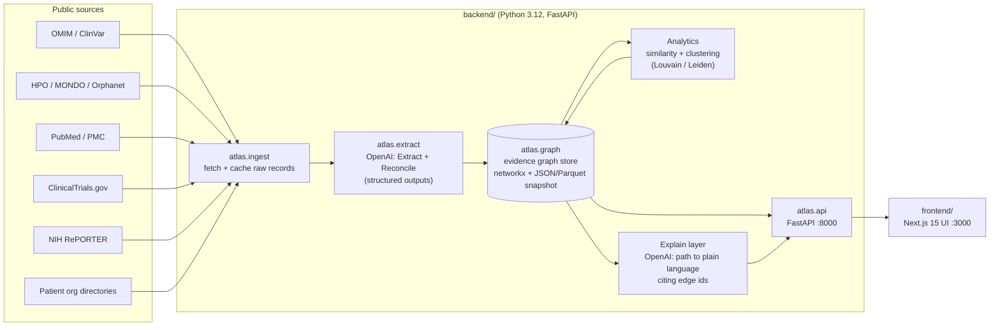

# Equilibrium: an evidence-first atlas for rare diseases

We are building an evidence-backed knowledge graph that takes a patient group from an isolated diagnosis to a cited connection, a reusable asset, a collaborator, and a concrete next step. When no connection is supported, it says so and explains why.

[](https://github.com/alijendoubi/equilibrium/actions/workflows/ci.yml)
[](https://github.com/alijendoubi/equilibrium/actions/workflows/security.yml)
[](https://github.com/alijendoubi/equilibrium/actions/workflows/docker.yml)
[](LICENSE)

Team **Equilibrium**'s submission to Hack-Nation's 7th Global AI Hackathon, Challenge 05: *AI Atlas for the World's Rare Diseases*, supported by OpenAI and the Buffalo Initiative.

> **Status:** early. This README separates what already exists from what is **planned**. See [Status](#status).

---

## The problem

- About **10,000** rare diseases are known. Roughly **80%** have a genetic cause, and about **5,000** are monogenic.
- Rare diseases affect about **350M** people worldwide, and fewer than **5%** of these diseases have an approved treatment.
- The knowledge is scattered across papers, disease databases, trial registries, funders and patient organizations. Groups rebuild assets that already exist because they cannot find them or tell whether they apply.
- **Disease names hide mechanisms.** Different genes can disrupt the same process. One gene can cause different effects. Similar symptoms can have different causes. Indexing by name misses research that communities could share.

The brief sets a 10x goal: help rare disease research move toward a possible treatment 10x faster.

## What Equilibrium does

The atlas is built around three questions from Maria, a patient organization leader:

1. *Who shares our disease characteristics?*
2. *What useful work already exists?*
3. *What should we do together next?*

**Maria's target journey (planned):**

```text
Search "disease X"
  -> disrupted mechanism (gene, variant effect, pathway)      [cited edge]
  -> another gene / related disease with the same mechanism    [cited edge]
  -> patient group working on that disease                     [cited edge]
  -> reusable asset: registry, natural history study, model    [cited edge]
  -> next step: sourced proposal + what needs expert review
```

**Honest-gap path:** when the graph holds no supported route, Maria sees:
- which sources were searched
- what evidence is missing
- the next question to test

She does not get a weak or invented link.

Every edge shows its source, relation type, confidence, evidence type (observed, inferred or curated) and any contradicting evidence. The other personas from the brief use the same graph:

| Persona | Need | Planned surface |
|---|---|---|
| Maria, patient org leader | Clusters, shared assets, partners, next experiment | Cluster view, pathway navigator, action view |
| Devon, newly diagnosed caregiver | Exact community, or closest related ones, in plain language | Global search with synonym resolution, plain-language explanations |
| Priya, biotech scout | Ranked clusters for one therapeutic mechanism | Mechanism-first ranked cluster list |
| Dr. Osei, researcher | Who else works on his mechanism under other gene names | Connector view: investigators and network overlap |

## Architecture



- **Extract:** OpenAI pulls genes, variants, phenotypes, claims and investigators out of abstracts into candidate edges. Each edge is tied to its source record.
- **Reconcile:** names and synonyms are resolved to stable IDs: MONDO, HGNC, HP, ClinVar VCV, PMID, NCT and others. One entity maps to one node.
- **Explain:** a graph path becomes plain language. Every sentence cites the edge id that supports it. Claims without an edge are rejected.

Details: [docs/ARCHITECTURE.md](docs/ARCHITECTURE.md) | Evidence model: [docs/EVIDENCE_MODEL.md](docs/EVIDENCE_MODEL.md) | Decisions: [docs/adr/](docs/adr/)

## Repository layout

```text
.
├── backend/              Python 3.12 + uv + FastAPI (atlas.api.main:app)
│   └── atlas/
│       ├── api/          HTTP layer (GET /health, GET /api/v1/meta)
│       ├── graph/        evidence graph store + analytics
│       ├── ingest/       source connectors
│       ├── extract/      OpenAI Extract / Reconcile
│       └── models/       Node / Edge / Provenance (evidence.py)
├── frontend/             Next.js 15 + TypeScript + Tailwind (pnpm, vitest, Playwright)
├── data/                 data conventions; raw/ and processed/ are not committed
│   └── scripts/          dataset build scripts
├── docs/                 architecture, evidence model, data sources, ADRs, runbook
├── scripts/github/       bootstrap-repo.sh, go-public.sh
├── .github/              workflows, rulesets, templates
├── docker-compose.yml
├── Makefile
└── .env.example
```

## Quickstart

**Prerequisites:** Python 3.12, [uv](https://docs.astral.sh/uv/), Node.js 20+ with pnpm, GNU Make. Docker is optional.

```bash
git clone https://github.com/alijendoubi/equilibrium.git
cd equilibrium
cp .env.example .env        # set OPENAI_API_KEY; other keys are optional
make setup                  # install backend (uv) and frontend (pnpm) deps

make dev-backend            # http://localhost:8000  (GET /health)
make dev-frontend           # http://localhost:3000  (run in a second terminal)
```

Or run both services in containers:

```bash
docker compose up --build
```

Run `make help` to list all targets. The common ones are `make check` (lint, typecheck and tests, the same as CI), `make fmt` and `make clean`.

### Environment

| Variable | Required | Purpose |
|---|---|---|
| `OPENAI_API_KEY` | yes, for Extract / Reconcile / Explain | OpenAI API access |
| `OPENAI_MODEL_EXTRACT` | no (default `gpt-6.1-sol`) | Model for Extract (abstract -> claim edges) |
| `OPENAI_MODEL_EXPLAIN` | no (default `gpt-6.1-sol`) | Model for Explain (path -> plain language) |
| `OPENAI_MODEL_RECONCILE` | no (default `gpt-6-luna`) | Model for Reconcile (ambiguous entity matches); fallback `gpt-5.4-mini` if structured outputs fail |
| `OPENAI_EMBED_MODEL` | no (default `text-embedding-3-small`) | Embedding model for Reconcile and semantic search |
| `NCBI_API_KEY` | no | Higher E-utilities rate limits (PubMed, ClinVar) |
| `OMIM_API_KEY` | no | OMIM API (license terms apply) |
| `CORS_ORIGINS` | no | Allowed frontend origins |
| `LOG_LEVEL` | no | Backend log level |
| `BACKEND_URL` | no | Backend URL used server-side by the frontend |
| `NEXT_PUBLIC_API_URL` | no | Backend URL used by the browser |

## Reproducing the dataset

> **Phase 2: not implemented yet.** This section describes the intended pipeline. It will be updated as the pipeline lands.

Planned:

```bash
make data    # PLANNED: ingest -> extract/reconcile -> build graph -> write snapshot
```

The planned stages are:
1. Fetch raw records for one focused disease cluster into `data/raw/`.
2. Run OpenAI Extract and Reconcile into normalized nodes and edges.
3. Build the graph and compute clusters.
4. Write a dated snapshot to `data/processed/` with a provenance manifest. See [data/README.md](data/README.md).

| Source | Feeds | Access | License / terms |
|---|---|---|---|
| MONDO | disease IDs, synonyms | OBO/JSON download | CC BY 4.0 (verify) |
| HPO | disease-phenotype, IC | annotations download | HPO license, free with attribution (verify) |
| ClinVar | gene-variant-disease | NCBI FTP / E-utilities | public domain, NCBI terms (verify) |
| OMIM | gene-phenotype, mechanism | API key | license required, restricted redistribution |
| Orphanet | disease, patient orgs | Orphadata | CC BY 4.0 (verify) |
| PubMed / PMC | claims, investigators | E-utilities | abstracts subject to publisher copyright; store IDs and extracted facts |
| ClinicalTrials.gov | studies, interventions | API v2 | public, NLM terms (verify) |
| NIH RePORTER | funding, investigators | API v2 | public (verify) |
| Patient org directories | patient groups, registries | manual curation / site terms | per-site terms (verify) |

Full table, priorities and slice choice: [docs/DATA_SOURCES.md](docs/DATA_SOURCES.md).

## Judging criteria: how we address them

| Criterion | Our approach | Status |
|---|---|---|
| Graph quality | Typed nodes with stable IDs. Mechanism- and phenotype-based clustering (IC-weighted HPO similarity, gene and pathway overlap, community detection). Counterexamples kept as contradiction edges. | Model drafted; clustering planned |
| Evidence integrity | Every edge has provenance (source, record id, URL, retrieval date), a confidence rubric and an evidence type (observed, inferred or curated). Contradictions are shown. | Model drafted; rubric documented |
| Patient progress | Maria's journey from disease to mechanism, related disease, patient group, asset and next step, with a sourced proposal or an honest gap report | Planned (M4) |
| 10x impact | One milestone (for example, launching a shared natural history study) compared against the existing timeline, with stated assumptions | Template in [docs/DEMO_SCRIPT.md](docs/DEMO_SCRIPT.md) |
| Ambition and product craft | One global search, progressive reveal, every edge explained, patient action view | Planned (M4) |
| Built with OpenAI | Extract, Reconcile and Explain with structured outputs. Explanations cite edge ids. | Planned (M2-M3) |

## Development workflow

- Branches are named `feat|fix|docs|chore|data/<short-desc>`. PR titles follow Conventional Commits, because PRs are squash-merged and the title becomes the commit.
- `main` is protected: PR required, approval from the code owner (@alijendoubi) only, required checks `backend`, `frontend`, `pr-title` and `secrets-scan`.
- Run `make check` locally before pushing.

See [CONTRIBUTING.md](CONTRIBUTING.md), [SECURITY.md](SECURITY.md) and [docs/RUNBOOK.md](docs/RUNBOOK.md).

## Team

| Name | Role | GitHub |
|---|---|---|
| Ali Jendoubi | Lead, code owner | [@alijendoubi](https://github.com/alijendoubi) |
| Khaled Md Saifullah | TBD | [@sagorhossain972](https://github.com/sagorhossain972) |
| Clara Hajj | TBD | [@clara578](https://github.com/clara578) |

## Status

Last updated: 2026-10-03

**Phase 1: Repo bootstrap (M1), done except CI execution and deploy wiring**
- [x] Challenge brief reviewed; docs, ADRs, evidence model and data source plan written
- [x] Monorepo scaffold (backend FastAPI `/health`, frontend Next.js) merged (#1); checks pass locally
- [x] Ruleset applied: PR required, code-owner (@alijendoubi) approval only, squash, required checks (#6)
- [x] Labels, milestones, teammates invited; Dependabot major bumps frozen until submission
- [x] Repo public; private vulnerability reporting enabled, so security and conduct reports go through GitHub (no contact email in the repo)
- [ ] CI, security, deploy workflows green on `main` (Actions jobs are not starting on this account yet)
- [ ] Vercel and Render connected (secrets not set)

Full project plan: [docs/PROJECT_PLAN.md](docs/PROJECT_PLAN.md) (cluster, data, OpenAI usage, timeline, risks, open decisions).
Task breakdown: [docs/EXECUTION_PLAN.md](docs/EXECUTION_PLAN.md) (phases, gates, task IDs, owners, issues).

**Phase 2: Graph slice (M2), not started**
- [x] Disease cluster chosen: GBA1/GCase–lysosomal dysfunction, Gaucher / GBA1 -> Parkinson's ([ADR 0003](docs/adr/0003-demo-cluster-gaucher-gba1.md), seed list in [docs/DATA_SOURCES.md](docs/DATA_SOURCES.md))
- [x] Curated orgs and assets drafted in `data/curated/` (needs human check)
- [x] Ingest connectors for the slice: Monarch (MONDO/HGNC/OMIM-sourced links/HPO annotations/GO), HPO IC, ClinVar counts, ClinicalTrials.gov, curated YAML; cache committed in `data/cache/` (#15, #16, #17)
- [ ] PubMed ingest
- [ ] OpenAI Extract and Reconcile into evidence edges
- [ ] `make data` reproduces a dated snapshot

**Phase 3: Trust layer (M3), not started.** Confidence, contradictions, coverage report, Explain with edge citations.

**Phase 4: UI journey (M4), not started.** Search, cluster view, edge explanation panel, patient action view.

**Phase 5: Submission (M5), not started.** See [docs/SUBMISSION_CHECKLIST.md](docs/SUBMISSION_CHECKLIST.md).

## License

[MIT](LICENSE). Third-party data keeps its own license. See [docs/DATA_SOURCES.md](docs/DATA_SOURCES.md).

## Acknowledgements

- Hack-Nation for the 7th Global AI Hackathon
- OpenAI and the Buffalo Initiative for supporting Challenge 05
- The data providers this work depends on: MONDO, the Human Phenotype Ontology, ClinVar and PubMed (NCBI/NLM), OMIM, Orphanet, ClinicalTrials.gov, NIH RePORTER, and the patient organizations who publish their work
- NIH RARe-SOURCE, cited in the brief as prior work combining biomedical data and AI

Equilibrium is a research and hackathon prototype. It is not medical advice.
