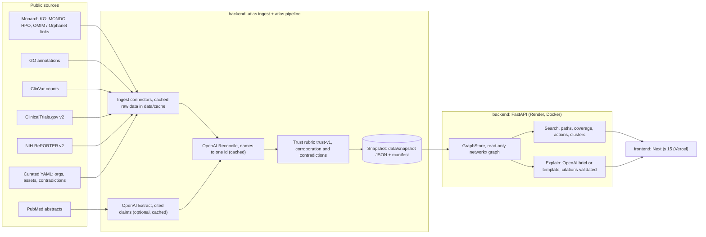

# Equilibrium: an evidence-first AI atlas for rare diseases

Equilibrium turns scattered rare-disease knowledge into an explainable, evidence-backed map. A patient-group leader can move from an isolated diagnosis to a shared mechanism, a reusable research asset, a partner and a concrete next step. **Every connection cites its source**, and when no supported route exists, the atlas says so.

Team **Equilibrium**'s submission to Hack-Nation's 7th Global AI Hackathon, **Challenge 05: AI Atlas for the World's Rare Diseases** (OpenAI × Buffalo Initiative).

| | |
|---|---|
| **Live app** | https://frontend-iota-eight-14.vercel.app |
| **Live API** | https://equilibrium-api-6wir.onrender.com/health · [OpenAPI docs](https://equilibrium-api-6wir.onrender.com/docs) |
| **Repository** | https://github.com/alijendoubi/equilibrium |
| **Run locally** | `docker compose up --build`, then open http://localhost:3000 ([Quickstart](#quickstart)) |

---

## Contents

1. [Why this matters](#why-this-matters)
2. [What it does: Maria's journey](#what-it-does-marias-journey)
3. [The demo slice: GBA1/GCase–lysosomal dysfunction](#the-demo-slice-gba1gcaselysosomal-dysfunction)
4. [Architecture](#architecture)
5. [Key decisions](#key-decisions)
6. [Evidence model and trust](#evidence-model-and-trust)
7. [Built with OpenAI](#built-with-openai)
8. [API reference](#api-reference)
9. [Data sources and reproducibility](#data-sources-and-reproducibility)
10. [Quickstart](#quickstart)
11. [Configuration](#configuration)
12. [Deployment](#deployment)
13. [Quality and testing](#quality-and-testing)
14. [Guardrails and restrictions](#guardrails-and-restrictions)
15. [Repository layout](#repository-layout)
16. [Status, limitations and next steps](#status-limitations-and-next-steps)
17. [Team, license, acknowledgements](#team)

---

## Why this matters

- About **10,000** rare diseases are known; roughly **80%** have a genetic cause and about **5,000** are monogenic.
- They affect about **350 million** people, and fewer than **5%** have an approved treatment.
- The knowledge a patient group needs is scattered across papers, disease databases, trial registries, funders and patient organisations. Groups rebuild assets that already exist because they cannot find them, or cannot tell whether they apply.
- **Disease names hide mechanisms.** Different genes can disrupt the same process, and one gene can cause different diseases. Searching by name misses research that communities could share.

Equilibrium organises knowledge by **mechanism and phenotype**, keeps the evidence attached to every link, and turns the result into an action a group can take this week.

## What it does: Maria's journey

Maria leads a family group for **neuronopathic Gaucher disease** (types 2 and 3). There is no approved treatment for the neurological disease, because enzyme replacement does not cross the blood-brain barrier (true as of 2026-10-04; venglustat for type 3 is under regulatory review).

```text
Search "Gaucher"                              -> one stable disease id (MONDO:0009266), names and synonyms resolved
  -> caused by GBA1 (HGNC:4177)                [OMIM + Orphanet via Monarch, curated]
  -> GBA1 is a risk factor for late-onset Parkinson disease (MONDO:0008199)   [OMIM + Orphanet]
  -> ASPro-PD, NCT05778617: phase 3 ambroxol trial, 330 people             [ClinicalTrials.gov]
  -> funded by Cure Parkinson's                                              [curated, cited URL]
  -> "What differs": PD patients 35-75 on 1260 mg/day for 104 weeks
                     vs the nGD pilot (Narita 2016): 5 patients, 25 mg/kg/day
  -> collaboration brief: every sentence cites an edge; lists what an expert must check
```

When there is no supported route, it says so. **Saposin C deficiency** (MONDO:0012517, an atypical Gaucher disease) shows an honest-gap card: sources searched with counts (0 trials, 0 NIH projects, no dedicated patient organisation), what is missing, the closest communities, and the next question to test.

| Persona | What the atlas gives them |
|---|---|
| **Maria**, patient-organisation leader | Path to a shared mechanism, partners, reusable assets, "what differs", a cited collaboration brief |
| **Devon**, newly diagnosed caregiver | One search box with synonym resolution, a plain-language brief, and an honest gap when nothing exists |
| **Priya**, biotech scout | Mechanism clusters with members, shared genes and pathways, bridges and counterexamples |
| **Dr. Osei**, researcher | Researchers whose NIH-funded projects span both communities (shared-investigator bridges) |

## The demo slice: GBA1/GCase–lysosomal dysfunction

We chose this cluster because neuronopathic Gaucher has a real neurological treatment gap, GBA1/GCase gives a biologically strong link to Parkinson's, and Parkinson's acts as our **validated anchor**. We do not claim to discover that known link. We use it to validate the system, then search the same gene–pathway–phenotype neighbourhood for less obvious diseases, assets, researchers and evidence gaps. See [ADR 0003](docs/adr/0003-demo-cluster-gaucher-gba1.md).

What the snapshot contains (`data/snapshot/manifest.json`, rubric `trust-v1`):

| | Count |
|---|---|
| Nodes | **832**: 35 diseases, 9 genes, 8 mechanisms, 424 phenotypes, 206 studies, 124 investigators, 18 funders, 4 patient groups, 3 publications, 1 asset |
| Edges | **1,498**: 977 curated and 521 observed. `has_phenotype` 872, `studies_condition` 243, `investigates` 167, `funds` 125, `caused_by` 32, `risk_factor_for` 21, `participates_in` 19, `represents` 14, `mentions` 3, `contradicts` 2 |
| Clusters | **7**, computed at startup: PSAP (9), GBA1 (8), SNCA (5), ATP13A2 (5), CTSD (4), SMPD1 (2), GBA2 (2) |

Findings the data surfaces honestly:
- Gaucher types I, II and III and late-onset Parkinson's group together **through GBA1**. They share few distinctive symptoms, so the grouping is gene-driven.
- **Saposin C deficiency** sits in the PSAP cluster, with a bridge to Gaucher type I through shared pathways and informative symptoms.
- **Counterexamples:** SCARB2 diseases split across clusters. Venglustat was positive in Gaucher type 3 (LEAP2MONO) but showed no benefit in GBA-Parkinson's (MOVES-PD); it is modelled as a curated `contradicts` edge.
- **11 shared-investigator bridges** from NIH RePORTER, 9 spanning the Gaucher/GBA1 and Parkinson's communities. A bridge means the person's project text matched both sides, not proof of joint work; check before outreach.

## Architecture



**Build time:** connectors fetch each source politely (timeouts, retries, rate limits) and cache the raw responses in `data/cache/`. They normalise everything to one evidence model and merge duplicates. The trust rubric scores every edge. The result is one deterministic snapshot plus a manifest of sources, versions, counts and OpenAI usage.

**Run time:** the API loads the snapshot once into an immutable in-memory graph. It answers search, path, coverage, action and cluster queries in milliseconds, and serves briefs from the explain cache or the deterministic template. The frontend renders from the API on the server and in the browser. If the API is unreachable, it falls back to bundled demo data and says so on screen ("Showing cached demo data").

## Key decisions

| Decision | Why | Record |
|---|---|---|
| Python/FastAPI backend + Next.js frontend, monorepo | Best biomedical and graph tooling in Python; a polished UI in Next.js; one repo, one review flow | [ADR 0001](docs/adr/0001-stack-and-monorepo.md) |
| Evidence-first graph | Every edge carries source, record id, URL, date, evidence type, confidence with reasons, and contradictions. Unsupported links are never shown as facts | [ADR 0002](docs/adr/0002-evidence-first-graph.md) |
| GBA1/GCase–lysosomal slice with a validated anchor | A real treatment gap, a strong mechanism link, a rich public record, and an honest-gap neighbour | [ADR 0003](docs/adr/0003-demo-cluster-gaucher-gba1.md) |
| Snapshot in memory, no database server | A few thousand nodes fit in memory; responses take milliseconds; deploys are reproducible because the snapshot is baked into the image | [ARCHITECTURE](docs/ARCHITECTURE.md) |
| Deterministic, offline-reproducible data | `make data-offline` rebuilds a byte-identical snapshot from the committed cache; a test enforces it | [Data](#data-sources-and-reproducibility) |
| CURIE ids everywhere | `MONDO:`, `HGNC:`, `HP:`, `GO:`, `clinicaltrials:NCT…`, `PMID:`, `org:`; edge ids are `E:` + 16 hex characters from a hash of the edge content | [EVIDENCE_MODEL](docs/EVIDENCE_MODEL.md) |
| OpenAI only, and cached | Required by the challenge; every OpenAI result is cached and committed, so the demo never depends on a live call | [Built with OpenAI](#built-with-openai) |
| Live OpenAI calls off in production by default | The public `/explain` endpoint must not run up a bill; `EXPLAIN_LIVE=1` opts in, rate limited per IP | [Guardrails](#guardrails-and-restrictions) |
| OMIM data via Monarch, no OMIM API | OMIM's licence restricts API use; Monarch republishes OMIM-sourced associations with attribution | [DATA_SOURCES](docs/DATA_SOURCES.md) |

## Evidence model and trust

Every edge records `source`, `source_record_id`, `url`, `retrieved_at`, `source_version`, `evidence_quote`, `extractor`, `confidence`, `confidence_reasons`, `evidence_type` (`observed` / `curated` / `inferred`) and `contradicted_by`. Full schema: [docs/EVIDENCE_MODEL.md](docs/EVIDENCE_MODEL.md).

**Confidence rubric `trust-v1`** (`backend/src/atlas/trust/rubric.py`):

| Evidence | Base |
|---|---|
| OMIM / Orphanet gene-disease (via Monarch), HPO annotation | 0.90 |
| GO annotation (non-IEA / IEA only) | 0.85 / 0.80 |
| Team-curated with a verified source | 0.80 |
| ClinicalTrials.gov condition match, NIH RePORTER project | 0.75 |
| ClinicalTrials.gov alias match | 0.65 |
| OpenAI-extracted claim (high / medium / low certainty) | 0.45 / 0.35 / 0.25 |

- **Bonus:** +0.05 per extra independent source, up to +0.15. 258 edges are backed by both OMIM and Orphanet and reach 0.95.
- **Penalty:** -0.15 per contradicting record.
- **Invariants:** values are clamped to [0.05, 0.99]. **Inferred edges are capped at 0.49, so AI-extracted links always rank below curated evidence.**
- **Path ranking:** cost = Σ −log(confidence), +1 per inferred edge, plus a penalty for routing through a phenotype hub. Strong, curated, mechanism-level routes come first.
- **Coverage report:** for any node, it lists what was searched, how many records each source returned, what is missing, and the next question. This powers the honest-gap card.

## Built with OpenAI

OpenAI models do three jobs. Each is constrained, validated and cached, and the UI labels AI-written text.

| Job | Where | Model / API | Guarantee |
|---|---|---|---|
| **Reconcile**: map names and synonyms to one stable node | `atlas/reconcile` | `text-embedding-3-small` (Embeddings API); `gpt-6-luna` (Responses API, strict JSON schema) for ambiguous cases only | The model may only pick an id from the candidate list (enumerated in the schema and re-validated). It cannot invent ids |
| **Explain**: turn a graph path into a collaboration brief | `atlas/explain`, `POST /api/v1/explain` | `gpt-6.1-sol` (Responses API, strict JSON schema) | Every step must cite edge ids from the path. Uncited steps, unknown ids or numbers not found in the evidence are rejected; one retry, then a deterministic template |
| **Extract**: pull cited claims from PubMed abstracts | `atlas/extract` | `gpt-6.1-sol` (structured outputs) | Ids come only from the slice; the quote must appear verbatim in the abstract; results are always `inferred` with PMID provenance and capped below curated confidence |

- **Labelled in the UI:** AI-written text carries an "AI-generated (model)" badge. Template text says "Template (AI unavailable)". Hypotheses are dashed.
- **Robust and cheap:** embeddings, reconcile decisions, explanations and extracted claims are cached in `data/cache/` and shipped in the Docker image. With no key or `ATLAS_OFFLINE=1`, the app serves the cache, then the template, and never fails because of the API.
- **OpenAI only:** `backend/tests/test_openai_only.py` fails if any other LLM SDK is imported or added as a dependency.
- **Current state of this build:** the OpenAI integrations are implemented and tested with mocked clients (Explain, Reconcile and Extract test suites). The project's OpenAI account had no remaining credits at submission, so **the deployed snapshot reports `openai_usage.calls = 0`** and briefs are served by the deterministic template, labelled as such. A key holder runs the commands below, commits `data/cache` and `data/snapshot`, and redeploys:

```bash
cd backend                     # needs OPENAI_API_KEY in backend/.env
make -C .. openai-smoke        # gpt-6.1-sol and gpt-6-luna structured outputs, embeddings
uv run python -m atlas.extract.cli fetch && uv run python -m atlas.extract.cli run   # ~147 abstracts
uv run python -m atlas.pipeline build --offline                                      # snapshot + real openai_usage
uv run python -m atlas.reconcile.cli embed --nodes ../data/snapshot/atlas-snapshot.json
uv run python -m atlas.explain.cli golden                                            # AI briefs for the demo path
```

## API reference

Base URL: `https://equilibrium-api-6wir.onrender.com` (interactive docs at `/docs`). Ids containing `:` are URL-encoded, e.g. `MONDO%3A0009266`.

| Method | Path | Returns |
|---|---|---|
| GET | `/health` | Status, version, snapshot `loaded` / `missing` |
| GET | `/api/v1/meta` | Snapshot id, counts, sources, OpenAI usage |
| GET | `/api/v1/search?q=&types=&limit=` | Ranked nodes with match reason (`exact` / `synonym` / `semantic`) and what was searched |
| GET | `/api/v1/nodes/{id}` | Node, top edges, neighbours, `cluster_id`, coverage status |
| GET | `/api/v1/nodes/{id}/neighbors` | Filtered neighbours (relations, minimum confidence, evidence type) |
| GET | `/api/v1/edges/{id}` | Full provenance, supporting and contradicting edges |
| GET | `/api/v1/paths?from=&to=&k=` | Up to 5 ranked paths (`edges[i]` joins `nodes[i]` and `nodes[i+1]`), or a coverage report |
| GET | `/api/v1/coverage/{id}` | Honest-gap report: sources searched with counts, missing evidence, next question |
| GET | `/api/v1/actions/{disease_id}` | Partners, reusable assets with "reusable" and "what differs", next experiment, review checklist, shared investigators |
| GET | `/api/v1/clusters`, `/api/v1/clusters/{id}` | Clusters, shared features, bridges, counterexamples, drawing edges with reasons |
| POST | `/api/v1/explain` | `{edge_ids (1-12), audience: family|researcher}` returns cited steps, summary, caveats and `source: cache|live|template` |

## Data sources and reproducibility

| Source | Access | Used for | Terms |
|---|---|---|---|
| Monarch Initiative KG (MONDO, HPO, OMIM / Orphanet associations) | Monarch API v3 | Diseases, synonyms, gene-disease links, phenotypes | Open; OMIM-sourced links shown with attribution, no OMIM API use |
| HPO annotations (`phenotype.hpoa`) | HPO release | Phenotype information content | Open, with HPO attribution |
| Gene Ontology | via Monarch / QuickGO | Mechanism annotations (8 curated lysosomal terms) | CC BY 4.0 |
| ClinVar | NCBI E-utilities | Pathogenic variant counts per gene | Public domain (NCBI) |
| ClinicalTrials.gov | API v2 | Studies, phase, status, enrolment, conditions | Public |
| NIH RePORTER | API v2 | Funded projects, investigators, funders | Public |
| PubMed | NCBI E-utilities | Abstract corpus for Extract (147 cached) | Abstracts used for claim quotes with PMID citation |
| Curated YAML | `data/curated/` | Patient organisations, assets, dose and population facts, contradictions | Every entry has a URL and retrieval date; 18/18 URLs and 9/9 trial records verified on 2026-10-04 |

Full source list and seed ids: [docs/DATA_SOURCES.md](docs/DATA_SOURCES.md).

```bash
make data-offline   # rebuild data/snapshot/ from the committed cache: no network, byte-identical (test-enforced)
make data           # refresh every source online (rewrites data/cache/), then rebuild
make data-report    # counts plus the hero-path and honest-gap checks
```

## Quickstart

**Docker (fastest):**
```bash
git clone https://github.com/alijendoubi/equilibrium && cd equilibrium
cp .env.example .env                 # every key is optional; the demo runs without any
docker compose up --build            # backend :8000 (snapshot baked in), frontend :3000 (live mode)
```
Open http://localhost:3000 and try the chips **Gaucher disease**, **GBA1** and **Saposin C deficiency**.

**Without Docker** (Python 3.12 + [uv](https://docs.astral.sh/uv/), Node 22+ + pnpm 11):
```bash
make setup
make dev-backend     # terminal 1: http://localhost:8000/docs
make dev-frontend    # terminal 2: http://localhost:3000
```
The frontend uses mock data unless `NEXT_PUBLIC_USE_MOCKS=false` and `NEXT_PUBLIC_API_URL=http://localhost:8000` are set (see `frontend/.env.example`).

## Configuration

| Variable | Where | Default | Purpose |
|---|---|---|---|
| `OPENAI_API_KEY` | backend | none | Enables live OpenAI calls (precompute CLIs, `EXPLAIN_LIVE`) |
| `OPENAI_MODEL_EXTRACT` / `OPENAI_MODEL_EXPLAIN` | backend | `gpt-6.1-sol` | Claim extraction and briefs |
| `OPENAI_MODEL_RECONCILE` | backend | `gpt-6-luna` | Ambiguous name resolution (fallback `gpt-5.4-mini`) |
| `OPENAI_EMBED_MODEL` | backend | `text-embedding-3-small` | Semantic search and reconcile |
| `EXPLAIN_LIVE` | backend | `0` | `1` lets the public `/explain` call OpenAI live; otherwise cache, then template |
| `EXPLAIN_RATE_PER_MINUTE` | backend | `10` | Per-IP limit on `/explain` |
| `CORS_ORIGINS` | backend | `http://localhost:3000` | Comma-separated frontend origins; `*` is rejected |
| `SNAPSHOT_PATH` | backend | `data/snapshot/atlas-snapshot.json` | Snapshot to load; caches are read from the sibling `data/cache/` |
| `NCBI_API_KEY` | backend (ingest) | none | Raises NCBI rate limits during `make data` |
| `LOG_LEVEL` | backend | `INFO` | Logging; keys are never logged |
| `NEXT_PUBLIC_USE_MOCKS` | frontend (build time) | `true` | `false` uses the live API |
| `NEXT_PUBLIC_API_URL` / `BACKEND_URL` | frontend | `http://localhost:8000` | API for the browser / for server rendering |

## Deployment

- **Backend: Render**, from [`render.yaml`](render.yaml) (Blueprint). It builds `backend/Dockerfile` from the repo root, with the snapshot and caches baked in; health check `/health`; runs as a non-root user. Set `CORS_ORIGINS` to the frontend URL.
- **Frontend: Vercel**, from `frontend/`, built with `NEXT_PUBLIC_USE_MOCKS=false` and `NEXT_PUBLIC_API_URL` set to the Render URL.
- Both redeploy from `main`. Step-by-step instructions: [docs/RUNBOOK.md](docs/RUNBOOK.md).

## Quality and testing

| Gate | Result at submission |
|---|---|
| Backend: `ruff check`, `ruff format --check`, `mypy --strict` | Clean |
| Backend: `pytest` (unit + API + pipeline, against the real snapshot) | **452 passed**, coverage **98.5%** (gate 80%) |
| Frontend: `eslint`, `tsc --noEmit`, `prettier --check`, `next build` | Clean |
| Frontend: `vitest` | **102 passed** |
| Playwright (Chromium), live backend | **4/4**: landing; search → Gaucher type II → path → evidence → actions → brief; honest-gap card; clusters |
| Playwright, backend stopped | **4/4**: the UI falls back to bundled data and shows the notice |
| API contract | Real API responses parsed through the frontend's zod schemas (13 demo responses, no mismatch) |
| Data checks | Snapshot rebuild is byte-identical; hero path and honest gap verified (`make data-report`); curated URLs and trials verified live |
| Security review | No secrets in the repo or caches; findings fixed (cache shipping, `/explain` rate limit and opt-in, output cap) |

```bash
make check                                                    # lint + typecheck + unit tests, backend and frontend
cd frontend && E2E_BASE_URL=http://localhost:3000 E2E_LIVE=1 pnpm test:e2e   # browser journeys against a running stack
```

GitHub Actions workflows (`ci`, `security`, `docker`, `e2e`) are in `.github/workflows/`. Actions could not run on the owner account during the hackathon, so every gate above was run locally before each merge. The `main` branch is protected: PRs, squash-only merges, linear history, code-owner approval.

## Guardrails and restrictions

**Medical and scientific integrity**
- **Research context only, not medical advice.** Briefs carry that caveat. Doses are shown as published research facts to compare, never as recommendations.
- **No invented links:** observed and curated edges require a source URL; AI output can only cite existing edge ids or ids from a candidate list; extracted claims need a verbatim quote and are always `inferred`.
- **Uncertainty is visible:** confidence with reasons, dashed hypotheses, contradictions (for example venglustat, and the contested PSAP–Parkinson's link), and honest-gap reports.
- **The known GBA1–Parkinson's link is presented as a validated anchor, not a discovery.** Shared-investigator bridges are flagged as text matches to verify before outreach.

**Data handling**
- Public data only. **No patient data or personal health information** is collected or stored. The app has no accounts or forms.
- Source terms are respected: no OMIM API (OMIM-sourced links come via Monarch with attribution); NCBI and RePORTER rate limits are honoured; every curated entry records its URL and retrieval date.
- `gaucherregistry.com` is **not** the ICGG Gaucher registry; on 2026-10-03 it served an online casino. The registry is linked only through its ClinicalTrials.gov record (NCT00358943).

**Security and cost**
- No secrets in the repo: `.env*` is gitignored, gitleaks runs in pre-commit and CI, and keys are `SecretStr` that are never logged.
- `/explain` is the only endpoint that can spend money. Live calls are **off by default** (`EXPLAIN_LIVE=0`); when on, there is a per-IP rate limit, a 1500-token output cap, a single validated retry and a 30 s timeout.
- Read-only API with bounded queries (query length, `limit` ≤ 50, `k` ≤ 5, path length ≤ 8). CORS uses an explicit allowlist; `*` is rejected at startup.
- Containers run as non-root. Private vulnerability reporting is enabled; see [SECURITY.md](SECURITY.md).

## Repository layout

```text
equilibrium/
├── backend/                     Python 3.12, FastAPI, uv
│   ├── src/atlas/
│   │   ├── api/                 routes (graph, explain, clusters), rate limiting, dependencies
│   │   ├── ingest/              connectors: monarch, hpo, go, clinvar, clinicaltrials, reporter, curated
│   │   ├── pipeline/            orchestrator, validation, deterministic snapshot + manifest
│   │   ├── graph/               store, queries (search/paths), coverage, actions, similarity, clusters
│   │   ├── trust/               confidence rubric trust-v1, contradictions
│   │   ├── reconcile/           normalisation, resolver, embeddings, OpenAI choice, search index
│   │   ├── explain/             prompt, validator, template, cache, OpenAI service, CLI
│   │   ├── extract/             PubMed corpus, OpenAI claim extraction, eval scaffold
│   │   └── models/              evidence model (Node, Edge, Provenance), API responses
│   ├── tests/                   pytest suites (unit, API, pipeline, golden paths)
│   └── Dockerfile               multi-stage, non-root; build context = repo root
├── frontend/                    Next.js 15, TypeScript strict, Tailwind, zod
│   ├── src/app/                 /, /search, /disease/[id], /path, /actions/[id], /clusters
│   ├── src/components/          evidence panel, action plan, explain panel, gap card, cluster graph
│   ├── src/lib/api/             typed client (live + mock + fallback), zod schemas
│   └── tests/                   vitest unit tests, Playwright e2e
├── data/
│   ├── curated/                 organisations, assets, mechanisms, aliases, contradictions (YAML)
│   ├── cache/                   committed raw source caches + OpenAI caches
│   ├── snapshot/                atlas-snapshot.json + manifest.json (served by the API)
│   └── eval/                    gold-set format for extraction evaluation
├── docs/                        architecture, evidence model, data sources, ADRs, runbook, plan, demo script
├── scripts/github/              repository bootstrap (labels, ruleset)
├── docker-compose.yml           local stack
└── render.yaml                  Render Blueprint for the API
```

## Status, limitations and next steps

**Done and verified:** data ingest from 7 sources plus curated data; the deterministic snapshot; the trust rubric and contradictions; the full API; clustering; the frontend journey with fallback; deployment on Render and Vercel; tests and security review.

**Known limitations**
- **OpenAI output is not in the deployed build yet:** there were no credits at submission (see [Built with OpenAI](#built-with-openai)). Search is lexical until embeddings are precomputed; briefs use the cited template.
- **The extraction accuracy check is not run:** it needs a human-labelled gold set of 15-30 abstracts (`data/eval/gold_claims.jsonl`); a model should not label its own gold set.
- **One slice:** the GBA1/GCase–lysosomal cluster. The pipeline is generic, but other clusters need their own curated seeds.
- **Clustering is gene-driven** in this slice, because informative shared phenotypes are sparse.
- **Human review pending:** curated organisation notes and the two contradiction entries are marked "needs human check". The cited PSAP–Parkinson's letter has no abstract and its conclusion is unverified.

**Next steps:** precompute the OpenAI caches and publish real usage; expert review of the brief by a Gaucher clinician and a Parkinson's trialist; check whether ASPro-PD collects GCase or glucosylsphingosine data; contact the International Gaucher Alliance; extend to a second cluster.

## Team

Team **Equilibrium**:

| Name | GitHub |
|---|---|
| Ali Jendoubi | [@alijendoubi](https://github.com/alijendoubi) |
| Khaled Md Saifullah | [@sagorhossain972](https://github.com/sagorhossain972) |
| Clara Hajj | [@clara578](https://github.com/clara578) |

## License

[MIT](LICENSE). Data remains under its sources' terms; see [docs/DATA_SOURCES.md](docs/DATA_SOURCES.md).

## Acknowledgements

Hack-Nation, OpenAI and the Buffalo Initiative for Challenge 05. Data from the Monarch Initiative, the Human Phenotype Ontology, the Gene Ontology, NCBI (ClinVar, PubMed), ClinicalTrials.gov, NIH RePORTER, Orphanet and OMIM (via Monarch), and the patient organisations cited in `data/curated/`.
