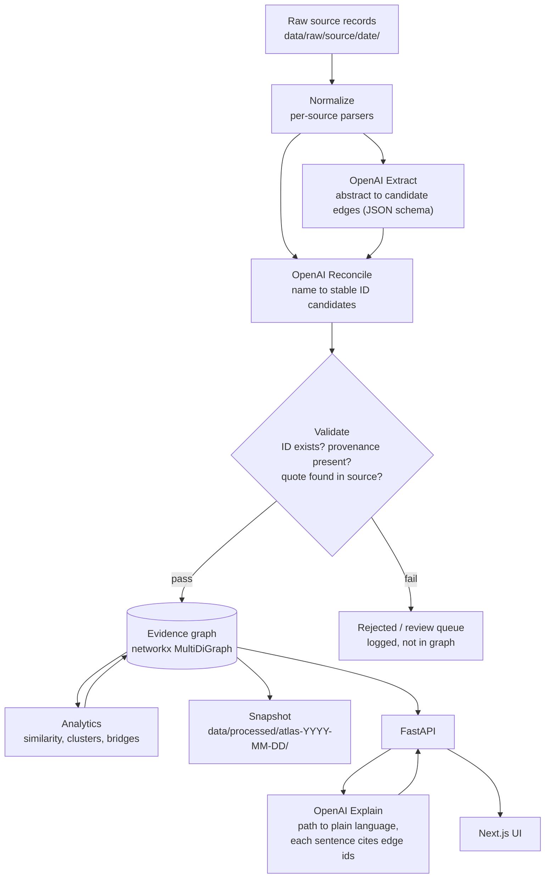
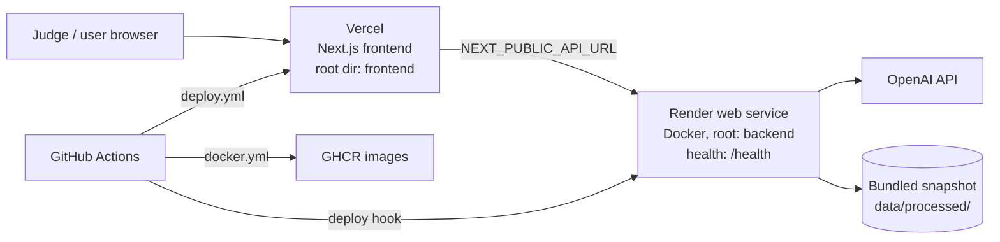

# Architecture

> Status: **design document**. Components marked *(planned)* do not exist yet. Today's scaffold has FastAPI with `GET /health` and `GET /api/v1/meta`, the Node/Edge/Provenance models in `atlas/models/evidence.py`, and a Next.js shell.

## Goals and constraints

- Show one complete journey within 24 hours. The journey goes from disease to mechanism, related disease, patient group, reusable asset and next step. When no supported route exists, it ends in an honest gap.
- **Evidence first:** no edge exists without provenance. See [ADR 0002](adr/0002-evidence-first-graph.md).
- OpenAI is used at three named points: **Extract**, **Reconcile** and **Explain**.
- Start with one focused disease cluster. The graph should be able to grow by adding sources, without a redesign.
- Keep operations simple: a single backend process, no database server required, and a snapshot that is reproducible from scripts.

## Components

| Component | Location | Responsibility | Status |
|---|---|---|---|
| Ingest | `backend/atlas/ingest/` | Source connectors. Fetch and cache raw records, record version and retrieval time | planned |
| Extract | `backend/atlas/extract/` | OpenAI structured-output extraction of entities and relations from abstracts and records | planned |
| Reconcile | `backend/atlas/extract/` | Map names and synonyms to stable IDs, and merge duplicate nodes | planned |
| Models | `backend/atlas/models/evidence.py` | `Node`, `Edge`, `Provenance`, `NodeType`, `EvidenceType` | drafted |
| Graph store | `backend/atlas/graph/` | In-memory `networkx.MultiDiGraph`. Load and save JSON or Parquet snapshots | planned |
| Analytics | `backend/atlas/graph/` | Similarity, clustering, path finding, coverage report | planned |
| Explain | `backend/atlas/graph/` or `extract/` | Turn a path into plain language that cites edge ids | planned |
| API | `backend/atlas/api/` | FastAPI on port 8000 | scaffold |
| UI | `frontend/` | Next.js 15 on port 3000: search, cluster view, edge panel, action view | scaffold |

## Data flow

Structured sources such as MONDO, HPO, ClinVar, ClinicalTrials.gov and RePORTER are mapped **deterministically**, without an LLM, wherever possible. The LLM is used where text is unstructured (abstracts, organization pages) and where name resolution is ambiguous.

## Graph model

The full specification is in [EVIDENCE_MODEL.md](EVIDENCE_MODEL.md). In summary:

- **Nodes** have a `NodeType`: disease, gene, variant, mechanism, phenotype, patient_group, publication, study, asset, investigator or funder. Each node has a stable namespaced ID, such as `MONDO:0009861`, `HGNC:1884` or `HP:0001250`.
- **Edges** are directed and typed with `relation`. Each edge has:
  - `provenance` (`source`, `source_record_id`, `url`, `retrieved_at`)
  - `confidence` (a number from 0 to 1)
  - `evidence_type` (`observed`, `inferred` or `curated`)
  - `contradicted_by` (a list of edge ids)
- A `MultiDiGraph` lets two sources assert the same relation as separate edges. This is how claims are cross-checked: agreement raises the displayed support, and conflicting claims stay visible.

## Clustering approach (planned)

The brief asks to cluster by **variant effect, pathway and phenotype rather than by name**. We compute a disease-disease similarity from several signals, then run community detection on the resulting weighted graph.

| Signal | Method | Notes |
|---|---|---|
| Phenotype similarity | HPO annotations compared with IC-weighted Jaccard, or Resnik best-match-average | Information content (IC) is computed from annotation frequency across the corpus. Rare, informative terms such as a specific seizure type outweigh broad ones like "intellectual disability". This answers the brief's request to distinguish broad from informative symptoms. |
| Gene / pathway overlap | Jaccard over causal genes plus their pathway or GO process sets | Pathway source still to be decided (for example Reactome or GO). See open questions. |
| Mechanism / variant effect | Shared `mechanism` nodes, such as loss of function, gain of function or toxic gain, from OMIM, ClinVar and Extract | Keeps "same gene, different mechanism" in separate groups, as in the brief's Gene A variant 1 vs variant 2 example |

- **Combined weight:** `w = a*phenotype + b*pathway + c*mechanism`. The weights are tuned by hand on the slice and documented. Each disease keeps only its k nearest neighbours above a threshold.
- **Community detection:** Louvain (`networkx.community.louvain_communities`, with a fixed seed so the result is reproducible), or Leiden (`leidenalg` with `igraph`) if it is worth adding the dependency.
- **Bridges:**
  - Diseases with high betweenness between clusters.
  - Investigators or funders linked to two or more clusters. This is the brief's "network overlap".
- **Defensibility:** each cluster membership is explained by its top contributing shared terms, genes or mechanisms. Each of those is a traceable edge. Counterexamples are kept: disease pairs that share a gene but differ in mechanism are shown as "not clustered, and why".

## OpenAI usage points

All three points use **structured outputs** (JSON schema), use a low temperature, and log each call with the model, prompt version and input hash, so the snapshot can be reproduced. Models come from `OPENAI_MODEL_EXTRACT` (default `gpt-6.1-sol`), `OPENAI_MODEL_EXPLAIN` (`gpt-6.1-sol`), `OPENAI_MODEL_RECONCILE` (`gpt-6-luna`) and `OPENAI_EMBED_MODEL` (`text-embedding-3-small`).

| Point | Input | Output schema (sketch) | Guardrails |
|---|---|---|---|
| **Extract** | Abstract or record text with its PMID or record ID | `[{subject, subject_type, relation, object, object_type, evidence_quote, polarity: supports/contradicts}]` | The `evidence_quote` must appear verbatim in the source text, or the claim is dropped. All extracted edges are `evidence_type=inferred` unless the source is curated. |
| **Reconcile** | Surface name, context and candidate IDs from ontology lookups | `{chosen_id, alternatives[], rationale, match: exact/synonym/broader/none}` | Only IDs from the candidate list are accepted. The model cannot invent an ID. `none` is a valid answer. |
| **Explain** | A path as an ordered list of edges with provenance | `{steps: [{text, edge_ids[]}], uncertainties[], next_question}` | Every step must cite at least one edge id on the path. A step with uncited text is rejected and regenerated, or omitted. |

## Storage

For the hackathon, the graph lives **in memory as networkx** in the backend process and is loaded at startup from a **snapshot**:
- `nodes.parquet` and `edges.parquet`, with JSON as an equally valid alternative
- a `manifest.json`

This needs no database server and diffs cleanly. A snapshot of a single cluster comfortably fits in memory.

Neo4j is optional and is a post-hackathon path, adopted only if graph size or query needs require it. See [ADR 0001](adr/0001-stack-and-monorepo.md).

## API sketch

Only the first two endpoints exist today. The rest are planned.

| Method | Path | Purpose |
|---|---|---|
| GET | `/health` | Liveness check |
| GET | `/api/v1/meta` | Version, snapshot id, sources and counts |
| GET | `/api/v1/search?q=` | Global search across diseases, genes, symptoms, groups and mechanisms, with synonym resolution |
| GET | `/api/v1/nodes/{id}` | Node detail and neighbourhood summary |
| GET | `/api/v1/nodes/{id}/neighbors?types=&min_confidence=` | Filtered neighbourhood |
| GET | `/api/v1/edges/{id}` | Edge with provenance, confidence, evidence type and contradictions |
| GET | `/api/v1/clusters` / `/api/v1/clusters/{id}` | Clusters with the shared features that explain membership |
| GET | `/api/v1/paths?from=&to=` | Ranked evidence paths |
| POST | `/api/v1/explain` | Body: list of edge ids. Returns a plain-language explanation with citations. |
| GET | `/api/v1/actions/{disease_id}` | Patient action view: shared assets, partners, next experiment, or an honest-gap coverage report |
| GET | `/api/v1/coverage/{node_id}` | Sources searched, records found and missing evidence |

## Deployment topology

- Each PR gets a Vercel preview, and pushes to `main` deploy to production. The backend is redeployed through a Render deploy hook. Both deploy steps are skipped when their secrets are missing.
- `docker compose up --build` reproduces both services locally.
- Setup steps are in [RUNBOOK.md](RUNBOOK.md).

## Open questions

- [x] Which disease cluster to start with: Gaucher / GBA1 -> Parkinson's (see [ADR 0003](adr/0003-demo-cluster-gaucher-gba1.md))
- [ ] Pathway source: Reactome, GO biological process, or mechanism nodes from Extract only
- [ ] Phenotype similarity: IC-weighted Jaccard (simpler) or Resnik BMA (needs the HPO DAG). Default to Jaccard and upgrade if time allows.
- [ ] Should Explain run live per request (cost and latency) or be pre-computed for demo paths and cached in the snapshot?
- [ ] Is OMIM licensing workable for a public snapshot? If not, use OMIM only at runtime with a key, and fall back to ClinVar and Orphanet for mechanism.
- [ ] Confidence calibration: hand-tuned rubric vs a small labelled set
- [ ] Should the snapshot ship inside the backend Docker image, or be fetched at start from a release asset?
